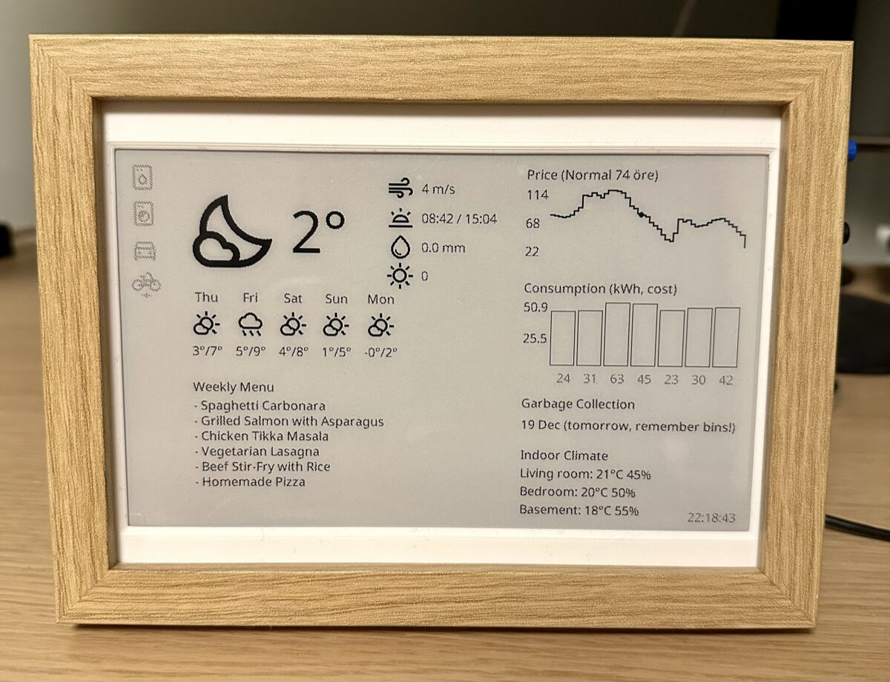

# E-Ink Dashboard Framework

A TSX framework for rendering e-ink dashboards on Raspberry Pi Zero 2 W.

Build declarative UI components with JSX, get type safety and snapshot testing, and render them to a Waveshare 7.5" e-ink display. No headless browser needed, rendering takes milliseconds.



## Hardware Guide

Want to build your own? There's a step-by-step guide covering hardware selection, soldering (optional), wiring, Raspberry Pi setup, and common pitfalls — [available here](https://karlssonoskar.gumroad.com/l/eink-dashboard) for $5.

## Quick Start

```bash
pnpm install

# Copy environment config
cp .env.example .env

# Run hello-world in mock mode
pnpm dev src/hello-world/main.tsx
```

This renders an image to a temp directory. Open the path printed in the terminal to see the output.

## Examples

The repo includes several examples to get you started:

- `src/hello-world/` — Minimal example, renders text to the display
- `src/hello-world-with-button/` — Adds a physical button interaction
- `src/fetch-example-openweather/` — Fetches weather data and renders it
- `src/mqtt-device-status/` — Listens for MQTT events and updates the display
- `src/home-dashboard/` — A complete personal dashboard with weather, electricity prices, meal plans, garbage collection, and device status. See it as a reference for how to build a complete app, but you'll want to create your own to match your setup.

## Hello World

```tsx
import { jsx } from "#lib";

export function App() {
  return (
    <view width={800} height={480} padding={40} direction="column" gap={20} background="white">
      <view direction="column" gap={8}>
        <text size={48} weight="bold" color="black">
          Hello World!
        </text>
      </view>
    </view>
  );
}
```

## Creating Your Own App

Install from GitHub:

```bash
pnpm add tjoskar/eink-pi-zero#main
```

Or clone the repo and create a new folder under `src/`:

```tsx
// src/my-app/main.tsx
import {
  jsx,
  Canvas,
  render,
  registerFont,
  setTheme,
  EINK_BW_THEME,
  renderToDisplay,
  initHardware,
} from "#lib";

function App() {
  return (
    <view width={800} height={480} padding={40} background="white">
      <text size={48} weight="bold">
        Hello from e-ink!
      </text>
    </view>
  );
}

setTheme({ ...EINK_BW_THEME, defaultFont: "Noto Sans" });
registerFont("./fonts/noto-sans-regular.ttf", "Noto Sans");

const canvas = Canvas.create(800, 480);
await render(<App />, canvas);

using _hardware = await initHardware();
await renderToDisplay(canvas.toPng());
```

Run it:

```bash
pnpm dev src/my-app/main.tsx
```

## Deploy to Raspberry Pi

```bash
# Deploy to Pi with rsync
pnpm deploy pi@raspberrypi.local

# On the Pi (first time only):
sudo ./scripts/setup-pi.sh

# Start the service:
sudo systemctl start eink-panel
sudo systemctl enable eink-panel
```

The `setup-pi.sh` script installs system dependencies, enables SPI, sets up the systemd service, and configures log rotation.

## Prerequisites

- **Node.js** >= 24
- **pnpm**
- **Raspberry Pi Zero 2 W** with 64-bit Raspberry Pi OS
- **Waveshare 7.5" V2 e-ink display** (800x480), or another Waveshare display with minor adjustments

For local development, you only need Node.js and pnpm.

## Why TSX?

I started this project in Python (the original code is on the `v1-python` branch). Python works well for this kind of project, but I found the imperative drawing style hard to maintain:

```python
draw.text((100, 100), "Hello World", font=font, fill=0)
```

With TSX, components are declarative and composable. You don't think about absolute coordinates, you get full type safety, and you can write snapshot tests to catch visual regressions.

The tradeoff: Python has much better GPIO and SPI support on the Pi. So the architecture is a hybrid — TypeScript handles all UI rendering, while a small Python daemon handles hardware (GPIO, buttons, LED, display) via JSON IPC. See [docs/architecture.md](./docs/architecture.md) for the full design rationale.

## License

MIT
